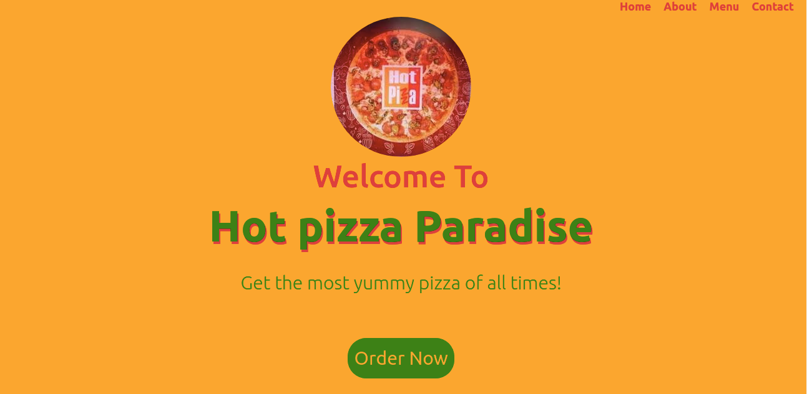

# Hot Pizza Paradise
#### A Hot Pizza Paradise Website Application, 17th September 2021
#### By **Ezekiel Kibiego**

## ScreenShot

## Description
This is a Pizza online Restaurant Web Application where users can order pizza and get it delivered to their homes and/or offices.

# Installation / Setup instruction

<ul>
<li>Open Terminal {Ctrl+Alt+T}</li>
<li>git clone https://github.com/ezekielkibiego/Hot-Pizza-Paradise.git</li>
<li>cd Hot-Pizza-Paradise/li>
<li>code . for VS code to run it</li>
<li>Go live or start your server</li>
</ul>

### Live Link

https://ezekielkibiego.github.io/Hot-Pizza-Paradise/

## Known Bugs

No known Bugs yet

## Technologies Used

<ul>
<li>JAVASCRIPT</li>
<li>HTML</li>
<li>CSS</li>
<li>BOOTSTRAP</li>
<li>jQuery</li>
</ul>

## BDD
Scroll Order-Now to the form sectin;

<ul>
<li>select your favorite type of Pizza, Crust and Toppings</li>
<li>Click Proceed to see the list selected and amount </li>
<li>Add pizza(as many as you can), click checkout</li>
<li>Click Delivery option if you will it to be deliverd</li>
<li>Fill in your delivery details and finally place your order</li>
<li>You'll see a notification detailing the total amount payable inclusive of Delivery cost as well as the delivery location</li>
</ul>

## Support and contact details
In case of any contributions or questions, email kibiezekiel@gmail.com

### License

 #### MIT LICENCE

Copyright (c) 2021 **Ezekiel Kibiego**

Permission is hereby granted, free of charge, to any person obtaining a copy
of this software and associated documentation files (the "Software"), to deal
in the Software without restriction, including without limitation the rights
to use, copy, modify, merge, publish, distribute, sublicense, and/or sell
copies of the Software, and to permit persons to whom the Software is
furnished to do so, subject to the following conditions:

The above copyright notice and this permission notice shall be included in all
copies or substantial portions of the Software.

THE SOFTWARE IS PROVIDED "AS IS", WITHOUT WARRANTY OF ANY KIND, EXPRESS OR
IMPLIED, INCLUDING BUT NOT LIMITED TO THE WARRANTIES OF MERCHANTABILITY,
FITNESS FOR A PARTICULAR PURPOSE AND NONINFRINGEMENT. IN NO EVENT SHALL THE
AUTHORS OR COPYRIGHT HOLDERS BE LIABLE FOR ANY CLAIM, DAMAGES OR OTHER
LIABILITY, WHETHER IN AN ACTION OF CONTRACT, TORT OR OTHERWISE, ARISING FROM,
OUT OF OR IN CONNECTION WITH THE SOFTWARE OR THE USE OR OTHER DEALINGS IN THE
SOFTWARE.
  
